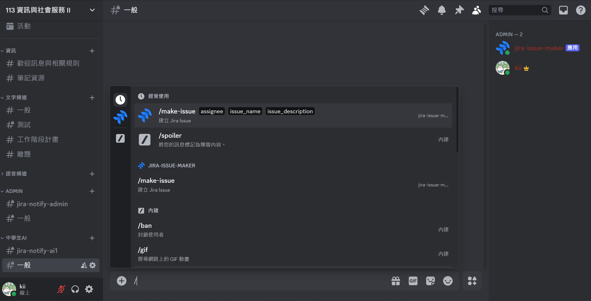
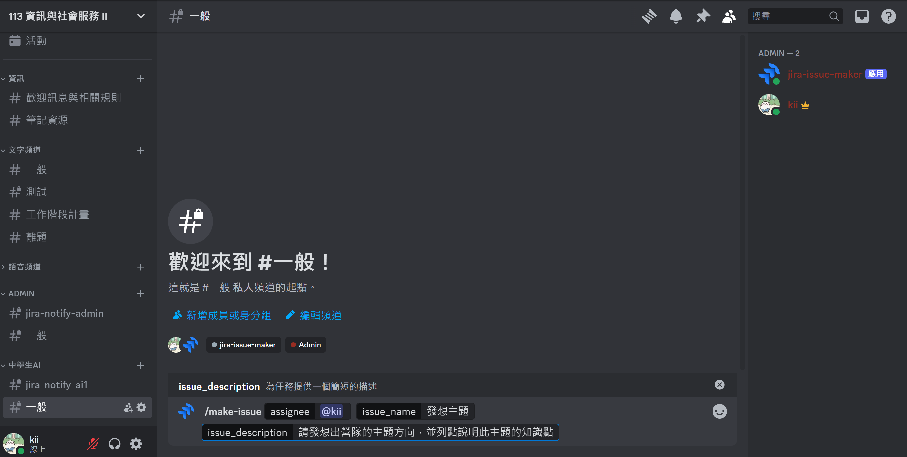
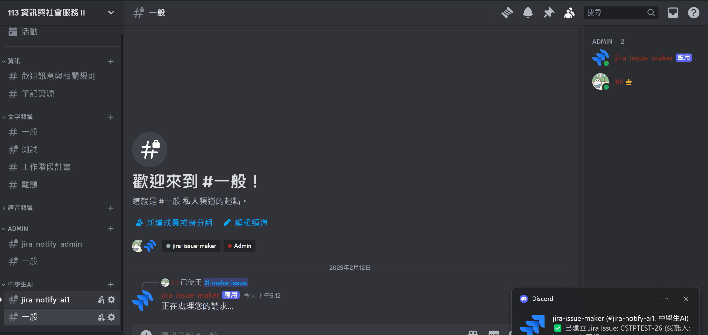
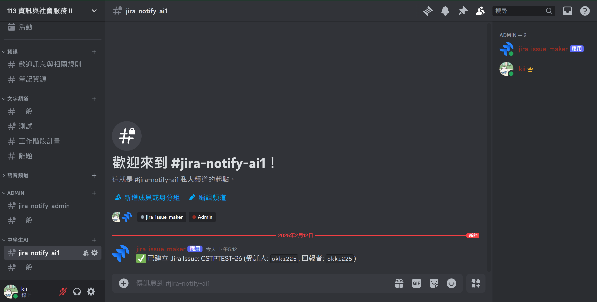

# Discord Jira Issue Creator Bot

這個專案是基於 Discord Bot 和 Jira API 建立的，用來讓 Discord 用戶直接在指定的 Discord 頻道中建立 Jira 任務（Issue）。Bot 支援指定受託人、設置任務標題、描述，並發送通知到相對應的頻道。

## 功能

- **建立 Jira Issue**：透過 Discord 指令 `/make-issue` 建立 Jira 任務。
- **指定受託人**：可以指定受託人來處理該任務，支援使用 Discord 用戶名稱或 @標註。
- **Issue 描述**：可以選擇為每個 Jira 任務加入描述。
- **頻道通知**：根據任務所屬的 Discord 頻道類別，將相關的 Jira Issue 通知發送到指定頻道。

## 使用方式

1. **啟動 Bot**：

   在機器使用命令啟動 Bot：

   ```bash
   python bot.py
   ```

2. **創建 Issue**：

   在 Discord 中，使用以下指令來創建一個 Jira Issue：

   ```
   /make-issue assignee="DiscordUser" issue_name="任務名稱" issue_description="任務描述"
   ```
   

   - `assignee`：指定受託人，也就是這個任務要給誰做。機器人支持 Discord 用戶名稱或 @標註。
   - `issue_name`：設定 Issue 的標題。
   - `issue_description`：設定 Issue 的描述。

   

3. **確認 Issue 創建**：

   當任務成功創建後，Bot 會在指定的通知頻道中發送以下訊息：

   ```
   ✅ 已建立 Jira Issue: CSTPTEST-1234 (受託人: `DiscordUser`, 回報者: `YourName`)
   ```
   
   

## 安裝與設置

1. **安裝依賴套件**：

   請先安裝所需的 Python 套件，使用以下指令：

   ```bash
   pip install -r requirements.txt
   ```

2. **環境變數設置**：

   創建一個 `.env` 文件，並將以下設置添加進去：

   ```env
   DISCORD_TOKEN=<YOUR_DISCORD_TOKEN>
   JIRA_URL=<YOUR_JIRA_URL>
   JIRA_EMAIL=<YOUR_JIRA_EMAIL>
   JIRA_API_TOKEN=<YOUR_JIRA_API_TOKEN>
   ```

   - `DISCORD_TOKEN`：從 [Discord 開發者平台](https://discord.com/developers/applications) 中獲取 Bot 的 Token。
   - `JIRA_URL`：您的 Jira 伺服器網址。
   - `JIRA_EMAIL` 和 `JIRA_API_TOKEN`：用於 Jira API 身份驗證的電子郵件和 API Token。

3. **用戶對應設定**：

   使用 `userMapping.py` 文件來設定 Discord 用戶和 Jira 帳戶的對應。確保每個 Discord 用戶名稱與其對應的 Jira 帳戶電子郵件匹配。

4. **設置頻道與專案映射**：

   在 `CATEGORY_PROJECT_MAPPING` 字典中，根據 Discord 頻道的類別名稱映射對應的 Jira 專案和通知頻道。例如：

   ```python
   CATEGORY_PROJECT_MAPPING = {
       "Admin": ("CSTPTEST", "jira-notify-admin"),
       "中學生AI": ("CSTPAI1", "jira-notify-ai1"),
       "小學生AI": ("CSTPAI2", "jira-notify"),
   }
   ```

   - `CSTPTEST` 和 `CSTPAI2` 是 Jira 中的專案代碼。
   - `jira-notify-admin` 等是 Discord 頻道的名稱，通知將發送至這些頻道。


## 注意事項

- 確保所有需要的環境變數和設定文件都已正確配置。
- 受託人和回報者必須在 Jira 中有有效的帳戶，並且要在 `userMapping.py` 文件中正確對應。
- 頻道類別名稱必須與 `CATEGORY_PROJECT_MAPPING` 中的鍵相匹配，以便發送通知。
- DC 群組內所有學生必須在 Google Sheet 中輸入完成 DC 用戶名稱以及 Jira 帳戶郵件
